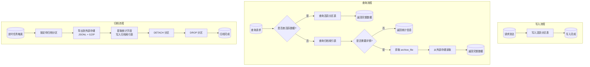
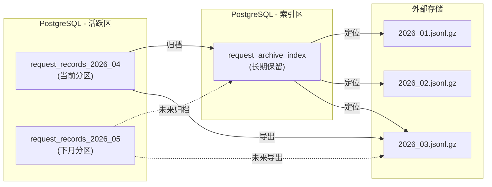
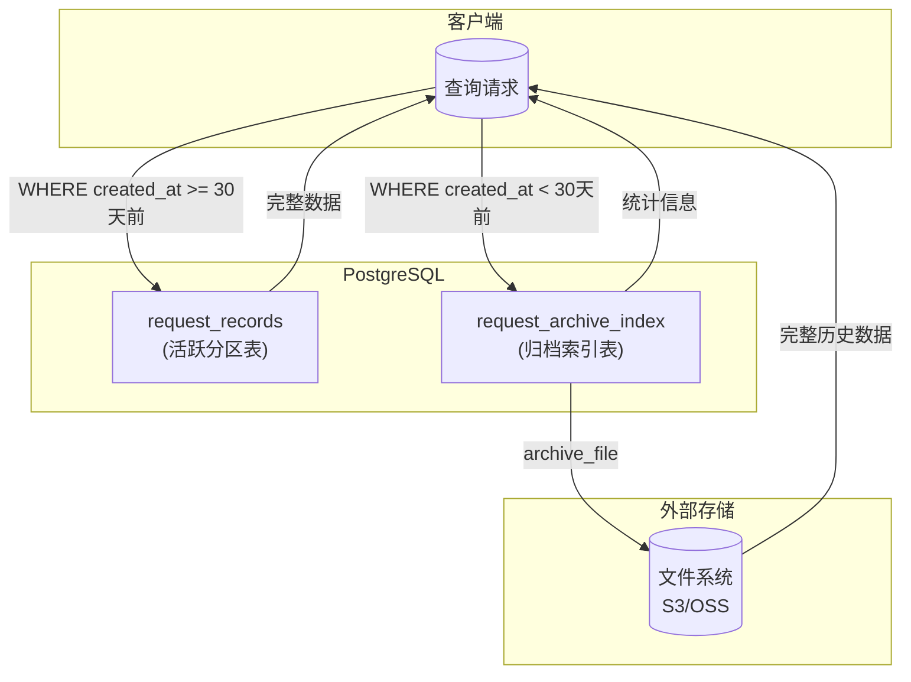
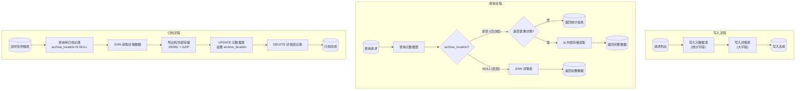
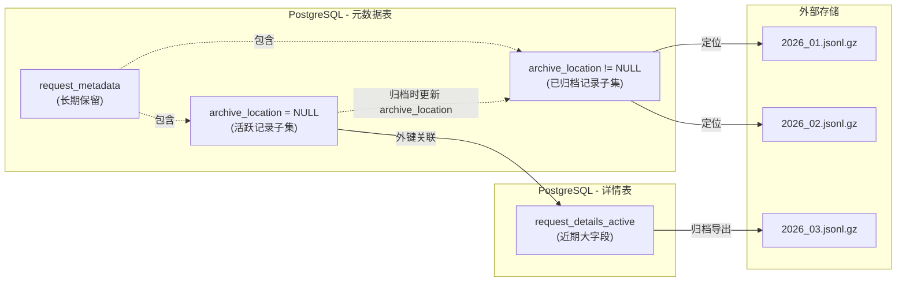
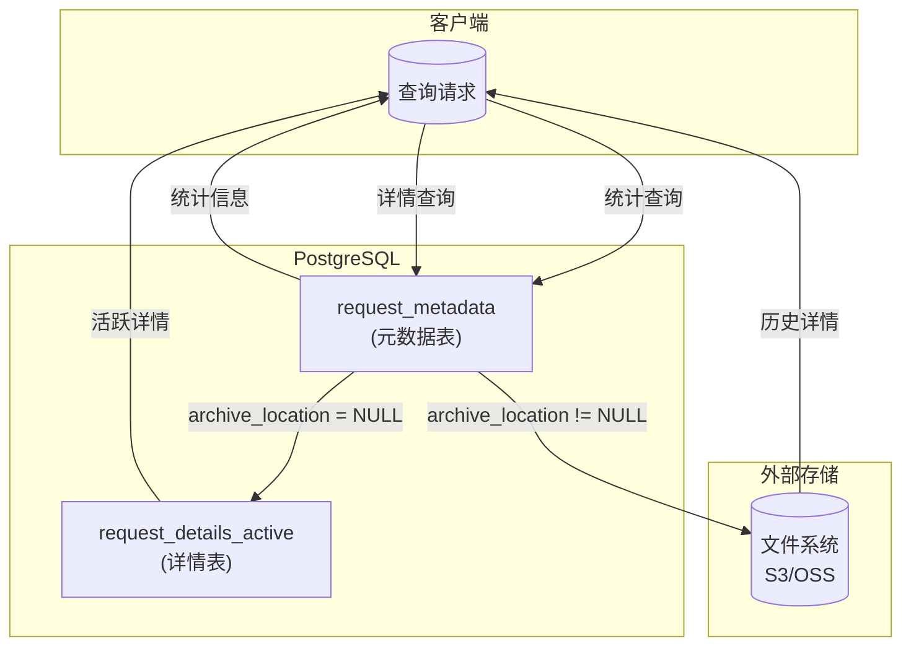
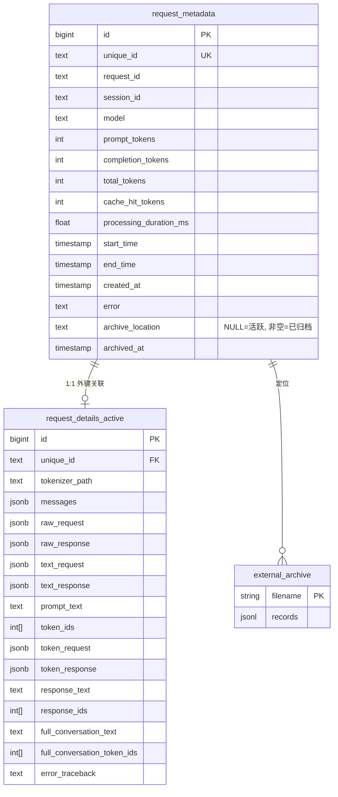
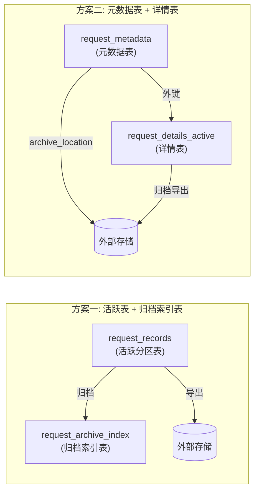

# 数据库架构优化方案

> **导航**: [文档中心](../README.md) | [当前设计](database.md)

## 背景

当前 `request_records` 表存储所有请求的完整轨迹数据，随着数据量增长面临以下问题：

1. **查询性能下降**：按 `session_id` 或时间查询变慢
2. **存储空间压力**：每条记录包含多个 JSONB 大字段，体积较大
3. **数据管理困难**：历史数据难以清理，备份成本高

### 当前表结构特点

- 约 30 个字段，其中 6 个大型 JSONB 字段（`raw_request`, `raw_response`, `text_request`, `text_response`, `token_request`, `token_response`）
- 单条记录约 50KB（完整数据）
- 主要查询模式：按 `session_id` 查询、按时间范围查询、统计聚合

---

## 方案一：活跃表 + 归档索引表 + 外部存储

### 架构设计

```
┌─────────────────────────────────────┐
│   request_records (活跃分区表)        │
│   近 N 天完整数据                     │
│   定期归档后删除                       │
└─────────────────────────────────────┘
              │ 定期归档
              ▼
┌─────────────────────────────────────┐
│   request_archive_index (归档索引)   │
│   轻量级，只存定位和统计信息           │
│   长期保留                            │
└─────────────────────────────────────┘
              │
              ▼
┌─────────────────────────────────────┐
│   外部存储 (S3/OSS/本地文件)          │
│   完整历史数据 (JSONL + GZIP)         │
│   /archives/2026_03.jsonl.gz         │
└─────────────────────────────────────┘
```

### 架构流程图



### 数据流向图



### 查询路径图



### 表结构设计

#### 活跃表（分区表）

```sql
-- 主表定义
CREATE TABLE request_records (
    id BIGSERIAL,
    unique_id TEXT NOT NULL,
    request_id TEXT NOT NULL,
    session_id TEXT NOT NULL,
    model TEXT NOT NULL,
    tokenizer_path TEXT,
    messages JSONB NOT NULL,

    -- 阶段1: OpenAI Chat 格式
    raw_request JSONB,
    raw_response JSONB,

    -- 阶段2: 文本推理格式（Token模式）
    text_request JSONB,
    text_response JSONB,

    -- 阶段3: Token 推理格式（Token模式）
    prompt_text TEXT,
    token_ids INTEGER[],
    token_request JSONB,
    token_response JSONB,

    -- 输出数据
    response_text TEXT,
    response_ids INTEGER[],

    -- 完整对话
    full_conversation_text TEXT,
    full_conversation_token_ids INTEGER[],

    -- 元数据
    start_time TIMESTAMP WITH TIME ZONE NOT NULL,
    end_time TIMESTAMP WITH TIME ZONE,
    processing_duration_ms FLOAT,

    -- 统计信息
    prompt_tokens INTEGER,
    completion_tokens INTEGER,
    total_tokens INTEGER,
    cache_hit_tokens INTEGER DEFAULT 0,

    -- 错误信息
    error TEXT,
    error_traceback TEXT,

    created_at TIMESTAMP WITH TIME ZONE DEFAULT NOW(),

    PRIMARY KEY (id, created_at)
) PARTITION BY RANGE (created_at);

-- 活跃分区（示例：2026年4月）
CREATE TABLE request_records_2026_04
    PARTITION OF request_records
    FOR VALUES FROM ('2026-04-01') TO ('2026-05-01');

-- 索引
CREATE INDEX idx_records_session ON request_records (session_id);
CREATE INDEX idx_records_start_time ON request_records (start_time DESC);
CREATE INDEX idx_records_unique ON request_records (unique_id);
```

#### 归档索引表

```sql
CREATE TABLE request_archive_index (
    id BIGSERIAL PRIMARY KEY,
    unique_id TEXT NOT NULL,
    session_id TEXT NOT NULL,
    model TEXT NOT NULL,
    start_time TIMESTAMP WITH TIME ZONE NOT NULL,

    -- 统计信息
    prompt_tokens INTEGER,
    completion_tokens INTEGER,
    total_tokens INTEGER,
    cache_hit_tokens INTEGER DEFAULT 0,
    processing_duration_ms FLOAT,

    -- 错误信息
    error TEXT,

    -- 归档位置
    archive_file TEXT NOT NULL,
    archived_at TIMESTAMP WITH TIME ZONE DEFAULT NOW()
);

-- 索引
CREATE INDEX idx_archive_session ON request_archive_index (session_id);
CREATE INDEX idx_archive_start_time ON request_archive_index (start_time DESC);
CREATE INDEX idx_archive_file ON request_archive_index (archive_file);
CREATE UNIQUE INDEX idx_archive_unique ON request_archive_index (unique_id);
```

### 查询方式

**活跃数据查询**（完整详情）：

```sql
-- 查询活跃数据
SELECT * FROM request_records WHERE session_id = 'xxx';

-- 查询最近请求
SELECT * FROM request_records ORDER BY start_time DESC LIMIT 20;
```

**历史数据查询**（统计信息）：

```sql
-- 查询历史统计
SELECT * FROM request_archive_index WHERE session_id = 'xxx';

-- 跨时间统计
SELECT model, COUNT(*), SUM(total_tokens)
FROM request_archive_index
WHERE start_time >= '2026-01-01'
GROUP BY model;
```

**历史详情查询**：

```python
# 1. 从索引表获取归档文件位置
archive_file = db.query(
    "SELECT archive_file FROM request_archive_index WHERE unique_id = ?", unique_id
)

# 2. 从外部存储读取详情
with gzip.open(f"/archives/{archive_file}") as f:
    for line in f:
        record = json.loads(line)
        if record["unique_id"] == unique_id:
            return record
```

### 归档流程

```
1. 锁定待归档分区（按 created_at 范围）
2. 导出完整数据到外部存储
   - 格式: JSONL + GZIP
   - 路径: /archives/{year}_{month}.jsonl.gz

3. 提取统计字段写入 request_archive_index
   - unique_id, session_id, model, start_time
   - tokens 统计, processing_duration_ms, error
   - archive_file 指向归档文件

4. DETACH 分区
5. DROP 分区表
```

### 归档脚本示例

```python
# scripts/tools/archive_records.py

import gzip
import json
from datetime import datetime, timedelta
from pathlib import Path

async def archive_partition(pool, year_month: str, archive_dir: Path):
    """
    归档指定月份的数据

    Args:
        pool: 数据库连接池
        year_month: 月份，格式 "2026_03"
        archive_dir: 归档目录
    """
    partition_name = f"request_records_{year_month}"
    archive_file = archive_dir / f"{year_month}.jsonl.gz"

    async with pool.connection() as conn:
        # 1. 查询分区数据
        records = await conn.fetch("""
            SELECT * FROM request_records
            WHERE created_at >= $1 AND created_at < $2
            ORDER BY created_at
        """, f"{year_month[:4]}-{year_month[5:]}-01", ...)

        # 2. 导出到外部存储
        with gzip.open(archive_file, 'wt') as f:
            for record in records:
                f.write(json.dumps(dict(record)) + '\n')

        # 3. 写入归档索引表
        await conn.executemany("""
            INSERT INTO request_archive_index (
                unique_id, session_id, model, start_time,
                prompt_tokens, completion_tokens, total_tokens,
                cache_hit_tokens, processing_duration_ms, error,
                archive_file
            ) VALUES ($1, $2, $3, $4, $5, $6, $7, $8, $9, $10, $11)
        """, [
            (r['unique_id'], r['session_id'], r['model'], r['start_time'],
             r['prompt_tokens'], r['completion_tokens'], r['total_tokens'],
             r['cache_hit_tokens'], r['processing_duration_ms'], r['error'],
             f"{year_month}.jsonl.gz")
            for r in records
        ])

        # 4. 分离并删除分区
        await conn.execute(f"ALTER TABLE request_records DETACH PARTITION {partition_name}")
        await conn.execute(f"DROP TABLE {partition_name}")
```

---

## 方案二：元数据表 + 活跃详情表 + 外部存储

### 架构设计

```
┌────────────────────────────────────────────────────────────┐
│                    request_metadata                         │
│              (元数据表，长期保留)                            │
│   unique_id, session_id, model, start_time, tokens, ...    │
│   archive_location: NULL | "2026_03.jsonl.gz"              │
└────────────────────────────────────────────────────────────┘
         │                              │
         │ archive_location IS NULL     │ archive_location NOT NULL
         ▼                              ▼
┌─────────────────────────┐    ┌─────────────────────────┐
│  request_details_active │    │    外部存储              │
│  (详情表，只存近期)       │    │  完整历史数据            │
│  大字段: raw_request...  │    │                         │
└─────────────────────────┘    └─────────────────────────┘
```

**核心思路**：将「统计字段」与「详情字段」分离，统计字段长期保留，详情字段定期归档。

### 架构流程图



### 数据流向图



### 查询路径图



### 表关系图



### 表结构设计

#### 元数据表（长期保留）

```sql
CREATE TABLE request_metadata (
    id BIGSERIAL PRIMARY KEY,
    unique_id TEXT NOT NULL UNIQUE,
    request_id TEXT NOT NULL,
    session_id TEXT NOT NULL,
    model TEXT NOT NULL,

    -- 统计信息（长期保留）
    prompt_tokens INTEGER,
    completion_tokens INTEGER,
    total_tokens INTEGER,
    cache_hit_tokens INTEGER DEFAULT 0,
    processing_duration_ms FLOAT,

    -- 时间字段
    start_time TIMESTAMP WITH TIME ZONE NOT NULL,
    end_time TIMESTAMP WITH TIME ZONE,
    created_at TIMESTAMP WITH TIME ZONE DEFAULT NOW(),

    -- 错误信息
    error TEXT,

    -- 归档位置（NULL = 在活跃详情表，非空 = 在外部存储）
    archive_location TEXT,

    -- 归档时间
    archived_at TIMESTAMP WITH TIME ZONE
);

-- 索引
CREATE INDEX idx_metadata_session ON request_metadata (session_id);
CREATE INDEX idx_metadata_start_time ON request_metadata (start_time DESC);
CREATE INDEX idx_metadata_archive ON request_metadata (archive_location);
```

#### 活跃详情表（只存大字段）

```sql
CREATE TABLE request_details_active (
    id BIGSERIAL PRIMARY KEY,
    unique_id TEXT NOT NULL UNIQUE
        REFERENCES request_metadata(unique_id) ON DELETE CASCADE,

    -- Tokenizer
    tokenizer_path TEXT,

    -- 大字段
    messages JSONB,
    raw_request JSONB,
    raw_response JSONB,
    text_request JSONB,
    text_response JSONB,
    prompt_text TEXT,
    token_ids INTEGER[],
    token_request JSONB,
    token_response JSONB,
    response_text TEXT,
    response_ids INTEGER[],
    full_conversation_text TEXT,
    full_conversation_token_ids INTEGER[],
    error_traceback TEXT
);

-- 索引
CREATE INDEX idx_details_unique ON request_details_active (unique_id);
```

### 查询方式

**统计查询**（只查元数据表）：

```sql
-- 查询 session 历史（轻量，长期可用）
SELECT unique_id, model, start_time, total_tokens, archive_location
FROM request_metadata
WHERE session_id = 'xxx'
ORDER BY start_time DESC;

-- 统计报表
SELECT model, COUNT(*), SUM(total_tokens), AVG(processing_duration_ms)
FROM request_metadata
WHERE start_time >= '2026-01-01'
GROUP BY model;

-- 缓存命中率分析
SELECT
    model,
    SUM(cache_hit_tokens)::float / NULLIF(SUM(prompt_tokens), 0) as cache_hit_rate
FROM request_metadata
GROUP BY model;
```

**活跃详情查询**（JOIN）：

```sql
-- 查询活跃数据详情
SELECT m.*, d.raw_request, d.raw_response, d.response_text
FROM request_metadata m
JOIN request_details_active d ON m.unique_id = d.unique_id
WHERE m.session_id = 'xxx' AND m.archive_location IS NULL;
```

**历史详情查询**：

```python
# 1. 检查是否已归档
meta = db.query(
    "SELECT archive_location FROM request_metadata WHERE unique_id = ?", unique_id
)

if meta['archive_location'] is None:
    # 活跃数据，JOIN 查询
    detail = db.query("""
        SELECT d.* FROM request_details_active d
        WHERE d.unique_id = ?
    """, unique_id)
else:
    # 已归档，从外部存储读取
    with gzip.open(f"/archives/{meta['archive_location']}") as f:
        for line in f:
            record = json.loads(line)
            if record["unique_id"] == unique_id:
                return record
```

### 统一视图（可选）

```sql
CREATE VIEW request_records AS
SELECT
    m.id, m.unique_id, m.request_id, m.session_id, m.model,
    m.prompt_tokens, m.completion_tokens, m.total_tokens,
    m.cache_hit_tokens, m.processing_duration_ms,
    m.start_time, m.end_time, m.created_at, m.error,
    m.archive_location,
    d.messages, d.raw_request, d.raw_response, d.response_text,
    d.full_conversation_text, d.full_conversation_token_ids,
    d.tokenizer_path, d.token_ids, d.response_ids
FROM request_metadata m
LEFT JOIN request_details_active d ON m.unique_id = d.unique_id;
```

**注意**：历史数据的大字段为 NULL，需通过 `archive_location` 从外部存储获取。

### 归档流程

```
1. 查询待归档的元数据记录
   SELECT unique_id FROM request_metadata
   WHERE archive_location IS NULL AND created_at < 阈值

2. 关联查询详情数据
   SELECT d.* FROM request_details_active d
   JOIN request_metadata m ON d.unique_id = m.unique_id
   WHERE m.archive_location IS NULL AND m.created_at < 阈值

3. 导出到外部存储
   - 格式: JSONL + GZIP
   - 路径: /archives/{year}_{month}.jsonl.gz

4. 更新元数据表
   UPDATE request_metadata
   SET archive_location = '{year}_{month}.jsonl.gz', archived_at = NOW()
   WHERE unique_id IN (...)

5. 删除活跃详情表记录
   DELETE FROM request_details_active
   WHERE unique_id IN (...)
```

### 归档脚本示例

```python
# scripts/tools/archive_records.py

import gzip
import json
from datetime import datetime, timedelta
from pathlib import Path

async def archive_details(pool, year_month: str, archive_dir: Path):
    """
    归档指定月份的详情数据

    Args:
        pool: 数据库连接池
        year_month: 月份，格式 "2026_03"
        archive_dir: 归档目录
    """
    archive_file = archive_dir / f"{year_month}.jsonl.gz"
    threshold = datetime.strptime(year_month, "%Y_%m") + timedelta(days=32)
    threshold = threshold.replace(day=1)

    async with pool.connection() as conn:
        # 1. 查询待归档的详情数据
        records = await conn.fetch("""
            SELECT d.*, m.unique_id
            FROM request_details_active d
            JOIN request_metadata m ON d.unique_id = m.unique_id
            WHERE m.archive_location IS NULL
              AND m.created_at < $1
        """, threshold)

        if not records:
            return

        # 2. 导出到外部存储
        with gzip.open(archive_file, 'wt') as f:
            for record in records:
                f.write(json.dumps(dict(record), default=str) + '\n')

        # 3. 更新元数据表
        unique_ids = [r['unique_id'] for r in records]
        await conn.execute("""
            UPDATE request_metadata
            SET archive_location = $1, archived_at = NOW()
            WHERE unique_id = ANY($2)
        """, f"{year_month}.jsonl.gz", unique_ids)

        # 4. 删除详情表记录
        await conn.execute("""
            DELETE FROM request_details_active
            WHERE unique_id = ANY($1)
        """, unique_ids)
```

---

## 方案对比

### 架构总览对比图



### 架构对比

| 维度 | 方案一 | 方案二 |
|------|--------|--------|
| **表数量** | 2 个（活跃表 + 归档索引表） | 2 个（元数据表 + 活跃详情表） |
| **数据分离** | 活跃/历史完全分离 | 统计/详情分离 |
| **外键关系** | 无 | 有（详情表引用元数据表） |
| **统计字段存储** | 冗余（活跃表 + 索引表各一份） | 无冗余（只在元数据表） |

### 查询对比

| 查询场景 | 方案一 | 方案二 |
|---------|--------|--------|
| **活跃数据详情** | 直接查活跃表 | JOIN 元数据+详情表 |
| **历史统计查询** | 查归档索引表 | 查元数据表 |
| **session 历史** | 分别查活跃表 + 索引表 | 只查元数据表（archive_location 指示详情位置） |
| **跨时间统计** | 分别查后应用层合并 | 直接查元数据表 |
| **历史详情查询** | 从外部存储读取 | 从外部存储读取 |

### 存储对比

假设数据规模：
- 活跃数据：100 万条/月
- 归档周期：30 天
- 完整记录：50KB/条
- 统计记录：200 字节/条

| 维度 | 方案一 | 方案二 |
|------|--------|--------|
| **活跃表大小** | 50KB × 100万 = 50GB | 详情表 50GB + 元数据表 200MB |
| **历史索引/元数据** | 200B × 1200万(1年) = 2.4GB | 200B × 1200万 = 2.4GB |
| **统计字段冗余** | 有（活跃表 + 索引表） | 无 |
| **清理方式** | DETACH + DROP 分区 | DELETE 详情表记录 |

### 维护对比

| 维度 | 方案一 | 方案二 |
|------|--------|--------|
| **归档操作** | 导出 + 写索引 + DROP 分区 | 导出 + UPDATE 元数据 + DELETE 详情 |
| **清理效率** | 高（DROP 分区是元数据操作） | 中（DELETE 产生 VACUUM 压力） |
| **分区管理** | 需要定期创建新分区 | 不需要 |
| **回滚能力** | 困难（分区已删除） | 较容易（元数据未删除，可重新导入） |

### 优缺点总结

#### 方案一：活跃表 + 归档索引表 + 外部存储

**优点**：
- 清理效率高，DROP 分区瞬间完成，无 VACUUM 压力
- 架构简单，活跃表与历史完全隔离
- 分区表查询性能好，自动分区裁剪

**缺点**：
- 统计字段冗余存储
- 查询需分别访问活跃表和索引表
- 需要管理分区生命周期

**适用场景**：
- 写入量大，追求归档效率
- 历史统计查询需求简单
- 可以接受应用层合并查询结果

#### 方案二：元数据表 + 活跃详情表 + 外部存储

**优点**：
- 统计字段无冗余
- 历史统计查询简单（只查元数据表）
- session 查询统一（archive_location 指示详情位置）
- 回滚相对容易

**缺点**：
- 清理效率略低，DELETE 产生 VACUUM 压力
- 活跃详情查询需要 JOIN
- 外键约束增加写入开销

**适用场景**：
- 频繁跨时间统计查询
- 需要统一 session 查询接口
- 对存储冗余敏感

---

## 推荐选择

| 场景 | 推荐方案 |
|------|---------|
| 写入量大，追求极致归档效率 | 方案一 |
| 频繁历史统计查询，需要统一接口 | 方案二 |
| 存储空间紧张，减少冗余 | 方案二 |
| 运维简单优先 | 方案一 |

---

## 实施建议

### 迁移步骤（通用）

1. **创建新表结构**
   - 方案一：创建分区主表、归档索引表
   - 方案二：创建元数据表、详情表

2. **数据迁移**
   - 停止写入或使用在线迁移工具
   - 将现有数据导入新表

3. **切换应用**
   - 修改 Repository 层代码
   - 配置归档任务

4. **清理旧表**
   - 验证新表正常后，DROP 旧表

### 配置项建议

```yaml
# config.yaml
archive:
  enabled: true
  # 归档周期（天）
  retention_days: 30
  # 归档执行时间（cron）
  schedule: "0 2 * * *"  # 每天凌晨 2 点
  # 归档存储路径
  storage_path: "/data/archives"
  # 归档文件格式
  format: "jsonl.gz"
  # 是否压缩
  compress: true
```

### 监控指标

- 活跃表/详情表大小
- 归档索引表/元数据表大小
- 归档任务执行时间和状态
- 外部存储空间使用
- 查询延迟（活跃 vs 历史）
