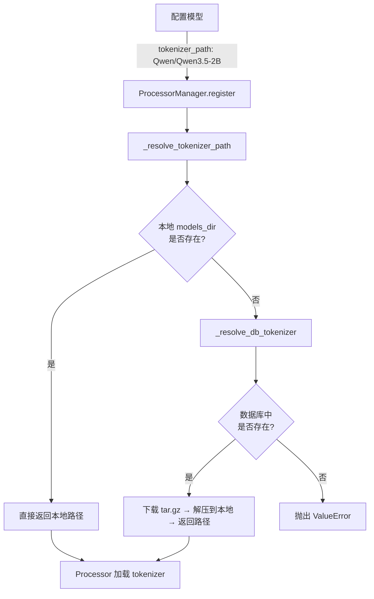
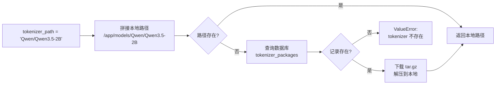
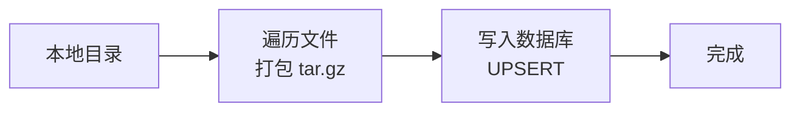
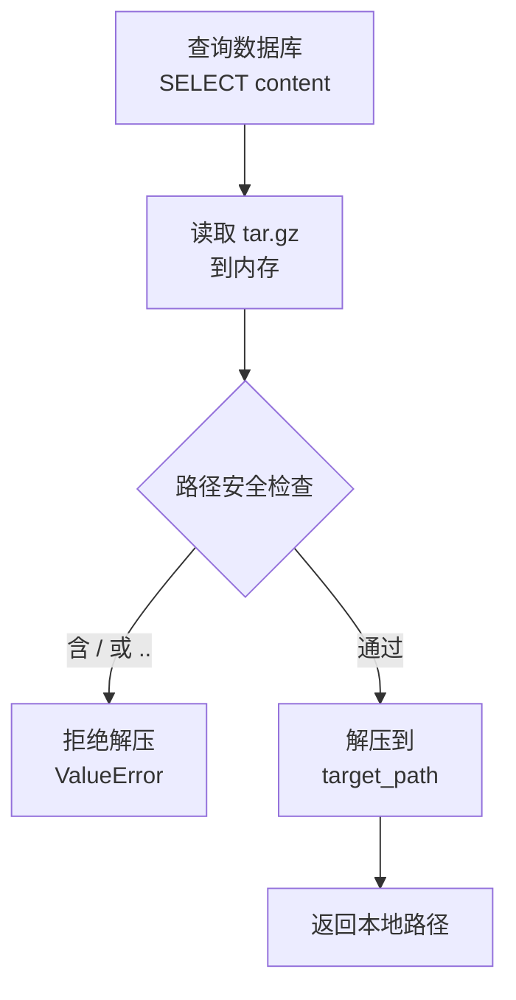
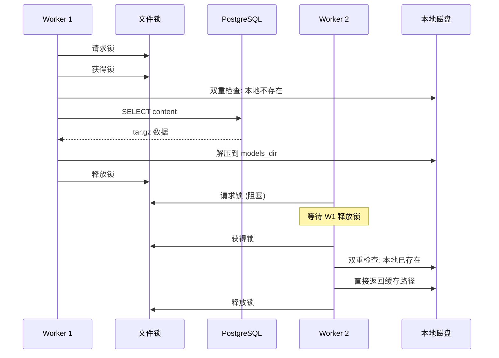
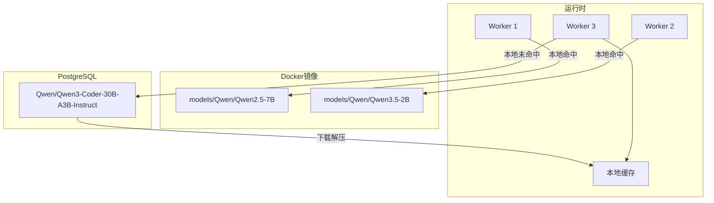
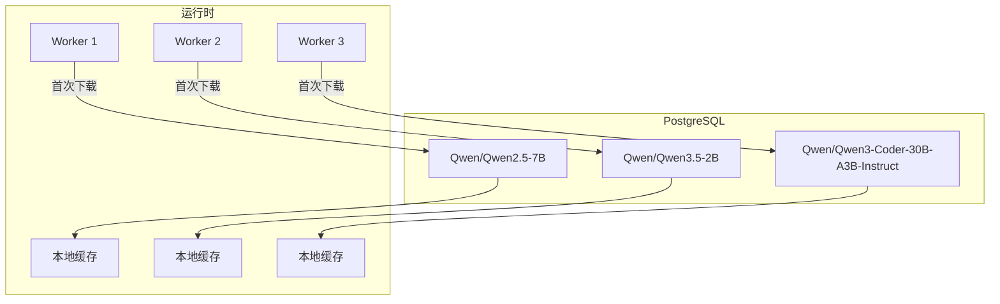

# Tokenizer 加载机制

## 概述

TrajProxy 支持两种 tokenizer 加载来源，按优先级自动回退：

1. **本地文件** — 镜像预置或手动放置在 `models_dir` 下
2. **数据库存储** — tokenizer 以 tar.gz 压缩包存储在 PostgreSQL，按需下载解压

对于多实例部署，无需在每个节点手动放置 tokenizer 文件，统一通过数据库管理即可。

## 整体流程



## 路径解析详解

`tokenizer_path` 仅支持**相对路径**，如 `Qwen/Qwen3.5-2B`。解析过程：



> 本地路径存在即命中，不会查询数据库。这是一个缓存优先策略。

## 数据库存储

### 表结构

```sql
tokenizer_packages (
    id          SERIAL PRIMARY KEY,
    name        TEXT NOT NULL UNIQUE,   -- 如 "Qwen/Qwen3.5-2B"
    content     BYTEA NOT NULL,        -- tar.gz 压缩包
    size        INTEGER NOT NULL,      -- 压缩包大小（字节）
    file_count  INTEGER,               -- 包含文件数
    created_at  TIMESTAMP DEFAULT NOW()
)
```

一个 tokenizer 对应一行，整个目录打包为单个 tar.gz 存入 `content` 字段。

### 上传流程



上传时自动将指定目录递归打包为 tar.gz，使用 `ON CONFLICT ... DO UPDATE` 支持覆盖更新。

### 下载流程



解压前对压缩包内每个成员路径做安全校验，禁止绝对路径和路径穿越。

## 并发安全

多 Worker 同时注册同一模型时，可能并发触发下载：



通过 `/tmp/tokenizer_dl_{name}.lock` 文件锁实现：
- 同一 tokenizer 同时只有一个 Worker 执行下载
- 获取锁后双重检查本地路径，避免重复下载

## 使用方式

### 上传 Tokenizer

```bash
# 单个上传
python scripts/manage_tokenizer.py upload \
    --name Qwen/Qwen3.5-2B \
    --path ./models/Qwen/Qwen3.5-2B

# 批量上传（自动扫描含 tokenizer_config.json 的目录）
python scripts/manage_tokenizer.py upload-all --models-dir ./models
```

### 配置模型

```yaml
proxy_workers:
  models:
    - model_name: qwen3.5-2b
      url: http://inference-server:8000/v1
      api_key: sk-xxxx
      tokenizer_path: Qwen/Qwen3.5-2B    # 相对路径
      token_in_token_out: true
```

首次使用时自动从数据库下载，后续使用本地缓存。

### 其他命令

```bash
# 列出数据库中的 tokenizer
python scripts/manage_tokenizer.py list

# 删除
python scripts/manage_tokenizer.py delete --name Qwen/Qwen3.5-2B

# 下载到本地（测试用）
python scripts/manage_tokenizer.py download --name Qwen/Qwen3.5-2B --output ./test
```

## 部署场景

### 场景一：镜像预置 + 数据库补充



常用 tokenizer 预置在镜像中，新模型通过数据库按需加载。

### 场景二：纯数据库管理



镜像中不预置 models 目录，所有 tokenizer 统一由数据库管理。可移除 Dockerfile 中 `COPY models/` 行以减小镜像体积。

## 常见问题

| 问题 | 原因 | 解决 |
|------|------|------|
| 上传失败："目录为空" | 指定目录无文件 | 确认路径指向含 `tokenizer_config.json` 的目录 |
| 首次请求延迟较高 | 需从数据库下载解压 | 属于正常现象，后续请求使用缓存 |
| 更新已上传的 tokenizer | 重复上传会覆盖 | 重新执行 `upload` 命令即可 |
| 清理本地缓存 | 需手动删除 | 删除 `models_dir` 下对应目录，下次请求自动重新下载 |
