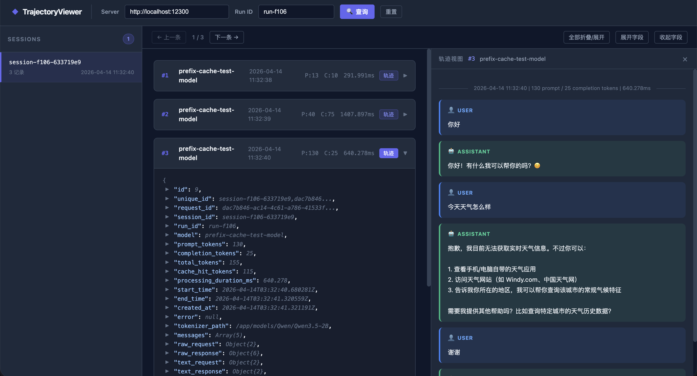

# Trajectory Viewer 使用文档

Trajectory Viewer 是一个用于查看和回放对话轨迹的可视化工具，可以帮助开发者调试和分析 Agent 的行为过程。

---

## 功能概述

Trajectory Viewer 提供以下核心功能：

- **Session 管理**：按 Run ID 查询和浏览所有相关 Session
- **轨迹记录**：查看每个 Session 的完整轨迹记录
- **JSON 树形展示**：以树形结构展示记录的 JSON 数据，支持折叠/展开
- **轨迹回放**：以聊天形式回放对话过程，包括系统提示、用户输入、助手回复和工具调用
- **导航控制**：支持上一条/下一条记录的快速导航

---

## 快速开始

### 1. 启动工具

直接在浏览器中打开 HTML 文件：

```bash
open scripts/replay_trajectory_viewer.html
```

### 2. 配置连接

在页面顶部的搜索栏中配置：

| 字段 | 说明 | 默认值 |
|------|------|--------|
| Server | TrajProxy API 服务地址 | `http://localhost:12300` |
| Run ID | 要查询的运行 ID | - |

### 3. 查询轨迹

1. 输入 Run ID（例如：`run-20240414-001`）
2. 点击「查询」按钮
3. 左侧列表将显示该 Run ID 下的所有 Sessions

### 4. 查看记录

1. 点击左侧列表中的任意 Session
2. 中间区域将显示该 Session 的所有轨迹记录
3. 使用工具栏的「上一条」/「下一条」按钮快速导航

### 5. 回放对话

1. 在记录卡片上点击「轨迹」按钮
2. 右侧面板将以聊天形式展示对话过程
3. 查看系统提示、用户消息、助手回复和工具调用的完整流程

---

## 界面说明

#### 1. 顶部搜索栏

- **Server**：配置 API 服务端点，默认为本地开发环境
- **Run ID**：输入要查询的运行标识符
- **查询按钮**：发起查询请求
- **重置按钮**：清空所有内容并重置状态

#### 2. 左侧 Session 列表

显示当前 Run ID 下的所有 Sessions：

- **Session ID**：唯一标识符
- **记录数量**：该 Session 包含的轨迹记录数
- **最后请求时间**：最后一条记录的时间戳

#### 3. 中间记录列表

以卡片形式展示轨迹记录：

- **记录索引**：卡片左上角的序号
- **模型名称**：使用的模型标识
- **时间戳**：记录创建时间
- **统计信息**：记录数、Token 数等
- **轨迹按钮**：点击在右侧面板查看对话回放
- **JSON 树**：点击卡片展开查看完整 JSON 数据

#### 4. 工具栏

记录列表上方的导航和操作按钮：

- **上一条/下一条**：快速导航到上一条或下一条记录
- **全部折叠/展开**：切换所有记录卡片的展开状态
- **展开字段**：展开所有 JSON 字段节点
- **收起字段**：收起所有 JSON 字段节点

#### 5. 右侧轨迹面板

以聊天形式展示对话过程：

| 角色 | 图标 | 说明 |
|------|------|------|
| system | 🟢 | 系统提示词 |
| user | 🔵 | 用户输入 |
| assistant | 🟢 | 助手回复 |
| tool | 🟡 | 工具调用 |

---

## API 说明

Trajectory Viewer 通过以下 API 端点获取数据：

### 1. 获取 Sessions 列表

```
GET /trajectories/sessions?run_id={run_id}
```

**参数**：
- `run_id`：要查询的运行 ID

**响应示例**：
```json
{
  "sessions": [
    {
      "session_id": "session-abc123",
      "record_count": 242,
      "last_request_time": "2024-04-14T10:30:45Z"
    }
  ]
}
```

### 2. 获取 Session 记录

```
GET /trajectories/{session_id}/records
```

**参数**：
- `session_id`：Session 唯一标识符

**响应示例**：
```json
{
  "records": [
    {
      "record_id": "record-001",
      "model": "claude-3-opus-20240229",
      "start_time": "2024-04-14T10:30:00Z",
      "request": { ... },
      "response": { ... },
      "trajectory": [
        {
          "role": "system",
          "content": "You are a helpful assistant..."
        },
        {
          "role": "user",
          "content": "What's the weather?"
        }
      ]
    }
  ]
}
```

---

## 使用示例

### 案例一：调试 Agent 行为

假设你的 Agent 在某些场景下表现异常，可以使用 Trajectory Viewer 追踪问题：

1. 获取异常场景的 Run ID
2. 在 Trajectory Viewer 中输入 Run ID 并查询
3. 浏览 Sessions，找到出问题的 Session
4. 查看轨迹回放，分析对话流程
5. 对比正确场景的轨迹，定位问题原因

### 案例二：分析 Token 消耗

了解 Agent 的资源使用情况：

1. 查询 Run ID 下的所有 Sessions
2. 查看每个 Session 的记录数和 Token 统计
3. 展开记录卡片，查看具体的 Token 使用详情
4. 识别高 Token 消耗的环节，优化 Prompt 或工具调用

### 案例三：验证模型输出

验证模型是否按预期执行：

1. 选择一个特定的 Session
2. 逐条查看轨迹记录
3. 在右侧轨迹面板回放完整对话
4. 检查系统提示、工具调用和最终输出是否正确

---

## 界面截图



---

## 常见问题

### Q: 为什么查询不到任何 Sessions？

A: 请检查以下几点：
1. Server URL 是否正确配置
2. Run ID 是否存在拼写错误
3. TrajProxy 服务是否正常运行
4. 网络连接是否正常

### Q: 轨迹面板显示不完整怎么办？

A: 较长的对话内容会自动折叠，点击「展开」按钮即可查看完整内容。

### Q: 如何导出轨迹数据？

A: 当前版本不支持直接导出，可以通过浏览器的开发者工具复制 JSON 数据。

---

## 技术细节

### JSON 树形展示

- 自动折叠长字符串（超过 200 字符）
- 大数组限制渲染条目（最多 200 条）
- 支持递归折叠/展开任意层级

### 聊天消息渲染

- 长消息自动折叠（超过 800 字符）
- 工具调用以专用格式展示
- 支持多轮对话的清晰分隔

---

## 相关文档

- [TrajProxy API 文档](api_proxy.md)
- [Nginx 入口 API](api_nginx.md)
- [系统架构设计](../design/architecture.md)
