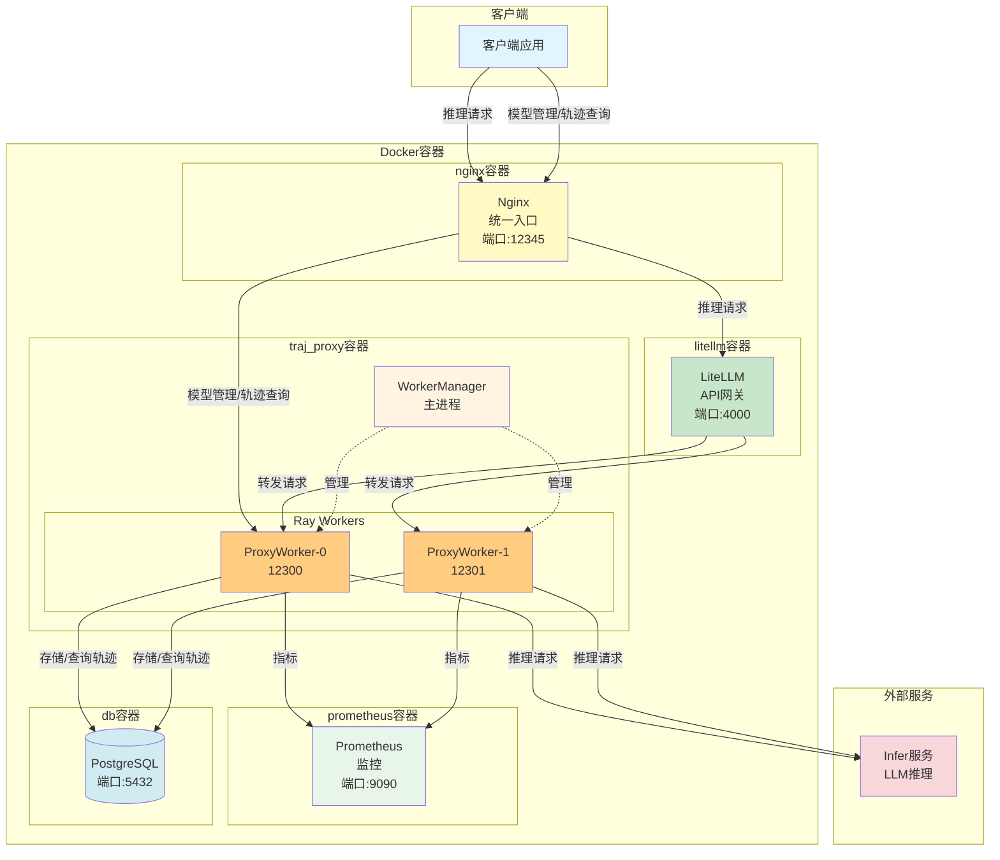
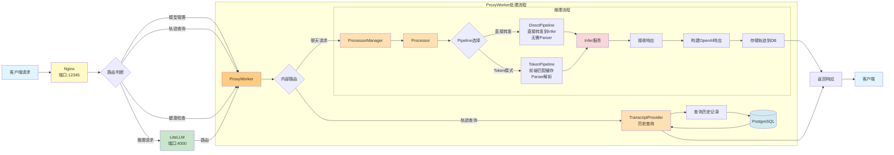

# TrajProxy - LLM 代理服务

TrajProxy 是一个 LLM 请求代理系统，提供 OpenAI 兼容 API、Token-in-Token-out 模式、动态模型管理和请求轨迹记录功能。

## 特性

- **OpenAI 兼容 API** - 无缝对接现有客户端
- **双模式处理** - 直接转发模式（轻量代理）和 Token-in-Token-out 模式（支持前缀匹配缓存）
- **动态模型管理** - 运行时注册/删除模型，跨 Worker 自动同步
- **请求轨迹记录** - 完整的对话历史存储
- **多 Worker 架构** - Ray 分布式处理，高并发支持
- **工具调用解析** - 支持 DeepSeek、Qwen 等多种格式的工具调用解析
- **推理内容解析** - 支持思维链内容提取

## 部署视图



## 请求处理流程



## 架构组件

| 组件 | 端口 | 说明 |
|------|------|------|
| Nginx | 12345 | 统一入口网关，路由推理请求和模型管理请求 |
| LiteLLM | 4000 | API 网关，提供统一的 OpenAI 兼容接口 |
| ProxyWorker | 12300-12320 | 统一的代理服务，集成 LLM 推理和轨迹查询功能 |
| PostgreSQL | 5432 | 数据库存储 |
| Prometheus | 9090 | 监控和指标收集 |

## 快速开始

### 前置要求

- Python 3.11+
- PostgreSQL 数据库
- LLM 推理服务（如 vLLM、Ollama）

### Docker 部署

```bash
# Docker Compose 模式
./scripts/start_docker_compose.sh start    # 启动服务
./scripts/start_docker_compose.sh stop     # 停止服务
./scripts/start_docker_compose.sh restart  # 重启服务

# All-in-One 模式
./scripts/start_docker_allinone.sh start    # 启动服务
./scripts/start_docker_allinone.sh stop     # 停止服务
./scripts/start_docker_allinone.sh restart  # 重启服务
```

### 验证服务

```bash
# 健康检查
curl http://localhost:12300/health

# 发送请求
curl -X POST http://localhost:12300/v1/chat/completions \
  -H "Content-Type: application/json" \
  -d '{"model": "qwen3.5-2b", "messages": [{"role": "user", "content": "你好"}]}'
```

## 项目结构

```
TrajProxy/
├── dockers/               # Docker 部署相关
│   ├── compose/           # Docker Compose 部署模式
│   │   ├── configs/       # 配置文件
│   │   ├── scripts/       # 启动脚本
│   │   ├── Dockerfile
│   │   └── docker-compose.yml
│   ├── allinone/          # All-in-One 部署模式
│   │   ├── configs/       # 配置文件
│   │   ├── scripts/       # 启动脚本
│   │   └── Dockerfile
│   └── images/            # 镜像文件
├── docs/                  # 详细文档
├── traj_proxy/            # 主代码
│   ├── proxy_core/        # 推理核心
│   ├── store/             # 存储层
│   ├── workers/           # Worker 管理
│   └── utils/             # 工具模块
├── tests/                 # 测试
├── scripts/               # 工具脚本
│   ├── archive_records.py
│   ├── download_tokenizer.py
│   └── verify_jinja_consistency.py
└── models/                # 模型文件
```

## 文档

详细文档请参阅 [docs/](docs/) 目录：

| 文档 | 说明 |
|------|------|
| [文档中心](docs/README.md) | 文档索引和导航 |
| [架构设计](docs/design/architecture.md) | Pipeline 架构、核心组件、处理流程 |
| [API 参考](docs/develop/api_reference.md) | API 文档索引 |
| [Nginx 入口 API](docs/develop/api_nginx.md) | Nginx 入口 (端口 12345) |
| [TrajProxy API](docs/develop/api_proxy.md) | 直接访问 Worker (端口 12300+) |
| [ID 设计规范](docs/design/identifier_design.md) | run_id、session_id 语义定义 |
| [数据库设计](docs/design/database.md) | 表结构、数据模型、归档机制 |
| [配置详解](docs/develop/configuration.md) | 配置文件说明、环境变量 |
| [部署指南](docs/develop/deployment.md) | 本地开发、Docker 部署 |
| [开发指南](docs/develop/development.md) | 开发环境、测试运行 |

## 端口说明

| 端口 | 服务 | 说明 |
|------|------|------|
| 12345 | Nginx | 统一入口网关（Docker 部署） |
| 4000 | LiteLLM | API 网关（Docker 部署） |
| 12300+ | ProxyWorkers | TrajProxy 服务 |
| 5432 | PostgreSQL | 数据库 |

## 许可证

MIT License
