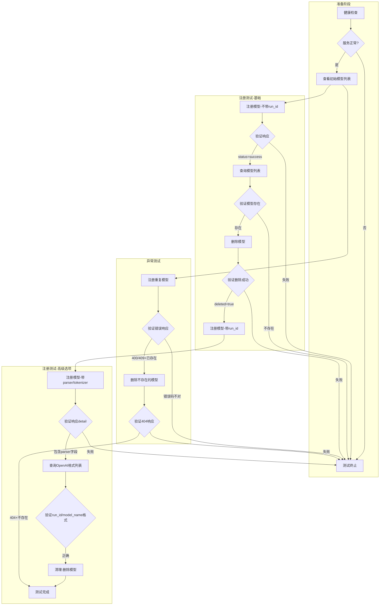
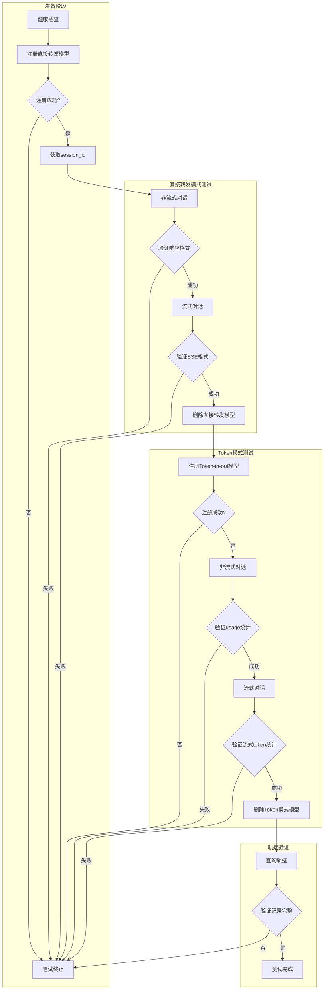
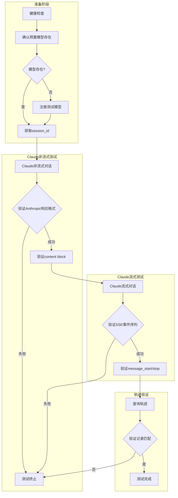
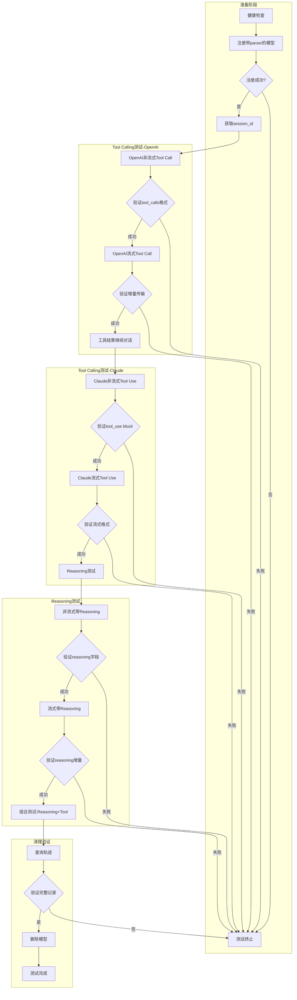

# TrajProxy 验证测试用例规范

## 文档概述

本文档定义 TrajProxy 系统的验证测试场景，用于手动或自动化验证系统功能。所有测试场景遵循 OpenAI API 规范（参考 vllm-0.16.0 实现），支持翻译为可执行脚本。

### 测试环境要求

| 组件 | 地址 | 说明 |
|------|------|------|
| TrajProxy | `http://localhost:12300` | 直接访问 Worker |
| Nginx 网关 | `http://localhost:12345` | 完整链路入口 |
| LiteLLM 网关 | `http://localhost:4000` | API 转换层 |
| 推理服务 | `http://localhost:8000` | vLLM/Ollama 推理 |

### 变量定义

| 变量 | 说明 | 示例值 |
|------|------|--------|
| `{{PROXY_URL}}` | TrajProxy Worker 地址 | `http://localhost:12300` |
| `{{NGINX_URL}}` | Nginx 网关地址 | `http://localhost:12345` |
| `{{TEST_MODEL}}` | 测试模型名 | `qwen3.5-2b` |
| `{{SESSION_ID}}` | 会话 ID | `verify_20260401_001,task_001` |
| `{{API_KEY}}` | API 密钥 | `sk-1234` |

---

## 场景一：模型注册、罗列、删除接口测试

### 场景说明

验证模型管理 API 的完整生命周期，包括不同配置选项的注册、查询和删除功能。

### Mermaid 流程图



### 测试步骤

| 步骤 | 操作 | 端点 | 说明 |
|------|------|------|------|
| 1 | GET | `/health` | 健康检查 |
| 2 | GET | `/models/` | 查看初始模型列表（管理格式） |
| 3 | POST | `/models/register` | 注册模型（不带 run_id） |
| 4 | GET | `/models/` | 验证注册成功 |
| 5 | DELETE | `/models` | 删除模型 |
| 6 | GET | `/models/` | 验证删除成功 |
| 7 | POST | `/models/register` | 注册模型（带 run_id） |
| 8 | GET | `/v1/models` | 验证 OpenAI 格式列表 |
| 9 | DELETE | `/models` | 删除模型（带 run_id） |
| 10 | POST | `/models/register` | 注册模型（带 parser） |
| 11 | GET | `/models/` | 验证配置详情 |
| 12 | DELETE | `/models` | 清理模型 |

### 步骤详情

#### 步骤 1: 健康检查

**请求:**
```bash
curl -X GET "{{PROXY_URL}}/health"
```

**预期响应:**
```json
{
  "status": "ok"
}
```

**断言:**
- HTTP 状态码 = 200
- `$.status` == "ok"

---

#### 步骤 3: 注册模型（不带 run_id）

**请求:**
```bash
curl -X POST "{{PROXY_URL}}/models/register" \
  -H "Content-Type: application/json" \
  -d '{
    "run_id": "",
    "model_name": "test_model_basic_001",
    "url": "http://localhost:8000/v1",
    "api_key": "sk-test-key",
    "tokenizer_path": "",
    "token_in_token_out": false
  }'
```

**预期响应:**
```json
{
  "status": "success",
  "run_id": "",
  "model_name": "test_model_basic_001",
  "detail": {
    "run_id": "",
    "model": "test_model_basic_001",
    "tokenizer_path": "",
    "token_in_token_out": false,
    "tool_parser": null,
    "reasoning_parser": null
  }
}
```

**断言:**
- HTTP 状态码 = 200
- `$.status` == "success"
- `$.model_name` == "test_model_basic_001"
- `$.detail.token_in_token_out` == false

---

#### 步骤 7: 注册模型（带 run_id）

**请求:**
```bash
curl -X POST "{{PROXY_URL}}/models/register" \
  -H "Content-Type: application/json" \
  -d '{
    "run_id": "run_test_001",
    "model_name": "test_model_with_runid",
    "url": "http://localhost:8000/v1",
    "api_key": "sk-test-key",
    "tokenizer_path": "Qwen/Qwen3.5-2B",
    "token_in_token_out": false
  }'
```

**预期响应:**
```json
{
  "status": "success",
  "run_id": "run_test_001",
  "model_name": "test_model_with_runid",
  "detail": {
    "run_id": "run_test_001",
    "model": "test_model_with_runid"
  }
}
```

**断言:**
- HTTP 状态码 = 200
- `$.status` == "success"
- `$.run_id` == "run_test_001"
- `$.detail.run_id` == "run_test_001"

---

#### 步骤 8: 验证 OpenAI 格式列表

**请求:**
```bash
curl -X GET "{{PROXY_URL}}/v1/models"
```

**预期响应:**
```json
{
  "object": "list",
  "data": [
    {
      "id": "run_test_001/test_model_with_runid",
      "object": "model",
      "created": 1712345678,
      "owned_by": "traj_proxy"
    }
  ]
}
```

**断言:**
- HTTP 状态码 = 200
- `$.object` == "list"
- `$.data[0].id` 包含 "run_test_001/test_model_with_runid"

---

#### 步骤 10: 注册模型（带 parser/tokenizer）

**请求:**
```bash
curl -X POST "{{PROXY_URL}}/models/register" \
  -H "Content-Type: application/json" \
  -d '{
    "run_id": "",
    "model_name": "test_model_full_config",
    "url": "http://localhost:8000/v1",
    "api_key": "sk-test-key",
    "tokenizer_path": "Qwen/Qwen3.5-2B",
    "token_in_token_out": true,
    "tool_parser": "deepseek_v3",
    "reasoning_parser": "deepseek_r1"
  }'
```

**预期响应:**
```json
{
  "status": "success",
  "run_id": "",
  "model_name": "test_model_full_config",
  "detail": {
    "run_id": "",
    "model": "test_model_full_config",
    "tokenizer_path": "Qwen/Qwen3.5-2B",
    "token_in_token_out": true,
    "tool_parser": "deepseek_v3",
    "reasoning_parser": "deepseek_r1",
    "sync_info": "模型已持久化到数据库，其他 Worker 将自动同步"
  }
}
```

**断言:**
- HTTP 状态码 = 200
- `$.status` == "success"
- `$.detail.token_in_token_out` == true
- `$.detail.tool_parser` == "deepseek_v3"
- `$.detail.reasoning_parser` == "deepseek_r1"
- `$.detail.tokenizer_path` != ""

---

#### 异常测试: 注册重复模型

**请求:**
```bash
# 假设模型已存在
curl -X POST "{{PROXY_URL}}/models/register" \
  -H "Content-Type: application/json" \
  -d '{
    "model_name": "{{TEST_MODEL}}",
    "url": "http://localhost:8000/v1",
    "api_key": "sk-test-key"
  }'
```

**预期响应:**
```json
{
  "detail": "模型 '{{TEST_MODEL}}' 已存在"
}
```

**断言:**
- HTTP 状态码 in [400, 409]
- `$.detail` 包含 "已存在" 或 "存在"

---

#### 异常测试: 删除不存在的模型

**请求:**
```bash
curl -X DELETE "{{PROXY_URL}}/models?model_name=nonexistent_model_xyz"
```

**预期响应:**
```json
{
  "detail": "模型 'nonexistent_model_xyz' 不存在 (run_id=)"
}
```

**断言:**
- HTTP 状态码 = 404
- `$.detail` 包含 "不存在" 或 "未找到"

---

### 验证标准汇总

| 验证项 | 成功条件 | 失败条件 |
|--------|---------|---------|
| HTTP 状态码 | 200 (成功), 400/409 (重复), 404 (不存在) | 其他状态码 |
| status 字段 | "success" | "error" 或无此字段 |
| deleted 字段 | true | false 或无此字段 |
| detail 包含信息 | 包含完整的配置详情 | 缺少关键字段 |
| 模型列表 | 包含已注册的模型 | 列表中无该模型 |

---

## 场景二：OpenAI Chat 测试

### 场景说明

验证 OpenAI 格式的聊天补全接口，包括直接转发模式和 Token-in-Token-out 模式的流式和非流式请求，以及轨迹记录功能。

### Mermaid 流程图



### 测试步骤

| 步骤 | 操作 | 端点 | 说明 |
|------|------|------|------|
| 1 | GET | `/health` | 健康检查 |
| 2 | POST | `/models/register` | 注册直接转发模型 (token_in_token_out=false) |
| 3 | POST | `/v1/chat/completions` | 非流式对话 |
| 4 | POST | `/v1/chat/completions` | 流式对话 (stream=true) |
| 5 | DELETE | `/models` | 删除直接转发模型 |
| 6 | POST | `/models/register` | 注册 Token-in-out 模型 |
| 7 | POST | `/v1/chat/completions` | 非流式对话 |
| 8 | POST | `/v1/chat/completions` | 流式对话 |
| 9 | DELETE | `/models` | 删除 Token 模式模型 |
| 10 | GET | `/trajectory` | 查询轨迹记录 |

### 步骤详情

#### 步骤 2: 注册直接转发模型

**请求:**
```bash
curl -X POST "{{PROXY_URL}}/models/register" \
  -H "Content-Type: application/json" \
  -d '{
    "model_name": "test_openai_direct",
    "url": "http://localhost:8000/v1",
    "api_key": "sk-test-key",
    "tokenizer_path": "",
    "token_in_token_out": false
  }'
```

**断言:**
- HTTP 状态码 = 200
- `$.status` == "success"
- `$.detail.token_in_token_out` == false

---

#### 步骤 3: 非流式对话（直接转发模式）

**请求:**
```bash
curl -X POST "{{PROXY_URL}}/v1/chat/completions" \
  -H "Content-Type: application/json" \
  -H "x-session-id: openai_test_001,sample_001,task_001" \
  -d '{
    "model": "test_openai_direct",
    "messages": [
      {"role": "user", "content": "你好，请回复'测试成功'"}
    ],
    "max_tokens": 100,
    "temperature": 0.7
  }'
```

**预期响应:**
```json
{
  "id": "chatcmpl-abc123",
  "object": "chat.completion",
  "created": 1712345678,
  "model": "test_openai_direct",
  "choices": [
    {
      "index": 0,
      "message": {
        "role": "assistant",
        "content": "测试成功"
      },
      "finish_reason": "stop"
    }
  ],
  "usage": {
    "prompt_tokens": 15,
    "completion_tokens": 5,
    "total_tokens": 20
  }
}
```

**断言:**
- HTTP 状态码 = 200
- `$.object` == "chat.completion"
- `$.choices[0].message.role` == "assistant"
- `$.choices[0].message.content` 非空
- `$.choices[0].finish_reason` in ["stop", "length"]
- `$.usage.total_tokens` > 0

---

#### 步骤 4: 流式对话（直接转发模式）

**请求:**
```bash
curl -X POST "{{PROXY_URL}}/v1/chat/completions" \
  -H "Content-Type: application/json" \
  -H "x-session-id: openai_test_001,sample_002,task_001" \
  -d '{
    "model": "test_openai_direct",
    "messages": [
      {"role": "user", "content": "说一个字：好"}
    ],
    "max_tokens": 10,
    "stream": true
  }'
```

**预期响应 (SSE 格式):**
```
data: {"id":"chatcmpl-xyz","object":"chat.completion.chunk","choices":[{"index":0,"delta":{"role":"assistant"},"finish_reason":null}]}

data: {"id":"chatcmpl-xyz","object":"chat.completion.chunk","choices":[{"index":0,"delta":{"content":"好"},"finish_reason":null}]}

data: {"id":"chatcmpl-xyz","object":"chat.completion.chunk","choices":[{"index":0,"delta":{},"finish_reason":"stop"}]}

data: [DONE]
```

**断言:**
- HTTP 状态码 = 200
- Content-Type 包含 "text/event-stream"
- 响应以 `data: [DONE]` 结束
- 至少收到一个包含 `delta.content` 的数据块
- `$.object` == "chat.completion.chunk"

---

#### 步骤 6: 注册 Token-in-Token-out 模型

**请求:**
```bash
curl -X POST "{{PROXY_URL}}/models/register" \
  -H "Content-Type: application/json" \
  -d '{
    "model_name": "test_openai_token",
    "url": "http://localhost:8000/v1",
    "api_key": "sk-test-key",
    "tokenizer_path": "Qwen/Qwen3.5-2B",
    "token_in_token_out": true
  }'
```

**断言:**
- HTTP 状态码 = 200
- `$.status` == "success"
- `$.detail.token_in_token_out` == true
- `$.detail.tokenizer_path` 非空

---

#### 步骤 7: 非流式对话（Token 模式）

**请求:**
```bash
curl -X POST "{{PROXY_URL}}/v1/chat/completions" \
  -H "Content-Type: application/json" \
  -H "x-session-id: openai_token_test,sample_001,task_001" \
  -d '{
    "model": "test_openai_token",
    "messages": [
      {"role": "user", "content": "请计算 1+1 等于多少"}
    ],
    "max_tokens": 50
  }'
```

**预期响应:**
```json
{
  "id": "chatcmpl-def456",
  "object": "chat.completion",
  "created": 1712345678,
  "model": "test_openai_token",
  "choices": [
    {
      "index": 0,
      "message": {
        "role": "assistant",
        "content": "1+1=2"
      },
      "finish_reason": "stop"
    }
  ],
  "usage": {
    "prompt_tokens": 12,
    "completion_tokens": 3,
    "total_tokens": 15
  }
}
```

**断言:**
- HTTP 状态码 = 200
- `$.usage.prompt_tokens` > 0
- `$.usage.completion_tokens` > 0
- `$.usage.total_tokens` == `prompt_tokens + completion_tokens`

---

#### 步骤 8: 流式对话（Token 模式，带 usage）

**请求:**
```bash
curl -X POST "{{PROXY_URL}}/v1/chat/completions" \
  -H "Content-Type: application/json" \
  -H "x-session-id: openai_token_test,sample_002,task_001" \
  -d '{
    "model": "test_openai_token",
    "messages": [
      {"role": "user", "content": "数到三"}
    ],
    "max_tokens": 20,
    "stream": true,
    "stream_options": {"include_usage": true}
  }'
```

**预期响应 (SSE 格式):**
```
data: {"id":"chatcmpl-ghi","object":"chat.completion.chunk","choices":[{"delta":{"role":"assistant"}}]}

data: {"id":"chatcmpl-ghi","object":"chat.completion.chunk","choices":[{"delta":{"content":"一"}}]}

data: {"id":"chatcmpl-ghi","object":"chat.completion.chunk","choices":[{"delta":{"content":"二"}}]}

data: {"id":"chatcmpl-ghi","object":"chat.completion.chunk","choices":[{"delta":{"content":"三"}}]}

data: {"id":"chatcmpl-ghi","object":"chat.completion.chunk","choices":[],"usage":{"prompt_tokens":5,"completion_tokens":3,"total_tokens":8}}

data: [DONE]
```

**断言:**
- HTTP 状态码 = 200
- 响应包含 usage 数据块（choices 为空数组）
- `usage.total_tokens` > 0
- `usage.prompt_tokens + usage.completion_tokens == usage.total_tokens`

---

#### 步骤 10: 查询轨迹记录

**请求:**
```bash
curl -X GET "{{PROXY_URL}}/trajectory?session_id=openai_token_test,sample_001,task_001&limit=10"
```

**预期响应:**
```json
{
  "session_id": "openai_token_test,sample_001,task_001",
  "count": 1,
  "records": [
    {
      "unique_id": "openai_token_test,sample_001,task_001,req-001",
      "request_id": "req-001",
      "session_id": "openai_token_test,sample_001,task_001",
      "model": "test_openai_token",
      "prompt_text": "请计算 1+1 等于多少",
      "response_text": "1+1=2",
      "prompt_tokens": 12,
      "completion_tokens": 3,
      "token_ids": [123, 456, 789],
      "full_conversation_token_ids": null,
      "start_time": "2024-01-01T00:00:00Z"
    }
  ]
}
```

**断言:**
- HTTP 状态码 = 200
- `$.session_id` == "openai_token_test,sample_001,task_001"
- `$.count` >= 1
- `$.records[0].model` == "test_openai_token"
- `$.records[0].prompt_tokens` > 0
- Token 模式下 `$.records[0].token_ids` 非空

---

### 验证标准汇总

| 验证项 | OpenAI 非流式 | OpenAI 流式 | Token 模式 |
|--------|-------------|------------|-----------|
| object | "chat.completion" | "chat.completion.chunk" | 同左 |
| choices[0].message | 包含 role, content | - | 同左 |
| choices[0].delta | - | 增量传输 content | 同左 |
| finish_reason | "stop" 或 "length" | 最后一个 chunk | 同左 |
| usage | 包含完整统计 | include_usage 时最后返回 | 精确统计 |
| 结束标记 | - | "data: [DONE]" | 同左 |
| 轨迹记录 | session_id 匹配 | session_id 匹配 | 包含 token_ids |

---

## 场景三：Claude Chat 测试

### 场景说明

验证通过 LiteLLM 网关的 Claude (Anthropic) 格式聊天请求，包括完整链路测试（Nginx -> LiteLLM -> TrajProxy）。

### Mermaid 流程图



### 测试步骤

| 步骤 | 操作 | 端点 | 说明 |
|------|------|------|------|
| 1 | GET | `/health` | 健康检查 |
| 2 | GET | `/v1/models` | 确认模型存在 |
| 3 | POST | `/s/{session_id}/v1/messages` | Claude 非流式对话 |
| 4 | POST | `/s/{session_id}/v1/messages` | Claude 流式对话 |
| 5 | GET | `/trajectory` | 查询轨迹记录 |

### 步骤详情

#### 步骤 3: Claude 非流式对话

**请求:**
```bash
curl -X POST "{{NGINX_URL}}/s/claude_test_001,sample_001,task_001/v1/messages" \
  -H "Content-Type: application/json" \
  -H "x-api-key: {{API_KEY}}" \
  -H "anthropic-version: 2023-06-01" \
  -d '{
    "model": "{{TEST_MODEL}}",
    "max_tokens": 100,
    "messages": [
      {"role": "user", "content": "你好，请回复'Claude测试成功'"}
    ]
  }'
```

**预期响应:**
```json
{
  "id": "msg_abc123",
  "type": "message",
  "role": "assistant",
  "content": [
    {
      "type": "text",
      "text": "Claude测试成功"
    }
  ],
  "model": "{{TEST_MODEL}}",
  "stop_reason": "end_turn",
  "usage": {
    "input_tokens": 20,
    "output_tokens": 10
  }
}
```

**断言:**
- HTTP 状态码 = 200
- `$.type` == "message"
- `$.role` == "assistant"
- `$.content[0].type` == "text"
- `$.content[0].text` 非空
- `$.usage.input_tokens` > 0
- `$.usage.output_tokens` > 0

---

#### 步骤 4: Claude 流式对话

**请求:**
```bash
curl -X POST "{{NGINX_URL}}/s/claude_test_001,sample_002,task_001/v1/messages" \
  -H "Content-Type: application/json" \
  -H "x-api-key: {{API_KEY}}" \
  -H "anthropic-version: 2023-06-01" \
  -d '{
    "model": "{{TEST_MODEL}}",
    "max_tokens": 50,
    "messages": [
      {"role": "user", "content": "说一个字：好"}
    ],
    "stream": true
  }'
```

**预期响应 (SSE 格式):**
```
data: {"type":"message_start","message":{"id":"msg_xyz","type":"message","role":"assistant","content":[]}}

data: {"type":"content_block_start","index":0,"content_block":{"type":"text","text":""}}

data: {"type":"content_block_delta","index":0,"delta":{"type":"text_delta","text":"好"}}

data: {"type":"content_block_stop","index":0}

data: {"type":"message_delta","delta":{"stop_reason":"end_turn"},"usage":{"output_tokens":1}}

data: {"type":"message_stop"}
```

**断言:**
- HTTP 状态码 = 200
- 包含 `message_start` 事件
- 包含 `content_block_delta` 事件
- `delta.type` == "text_delta"
- 包含 `message_stop` 事件
- 流式内容完整

---

#### 步骤 5: 查询轨迹记录

**请求:**
```bash
curl -X GET "{{PROXY_URL}}/trajectory?session_id=claude_test_001,sample_001,task_001&limit=10"
```

**断言:**
- HTTP 状态码 = 200
- `$.count` >= 1
- `$.records[0].session_id` == "claude_test_001,sample_001,task_001"

---

### 验证标准汇总

| 验证项 | Claude 非流式 | Claude 流式 |
|--------|-------------|------------|
| type | "message" | 事件类型序列 |
| role | "assistant" | message_start 中定义 |
| content | 数组，包含 text block | delta 增量传输 |
| stop_reason | "end_turn" | message_delta 中 |
| usage | input_tokens, output_tokens | 流式累计 |
| 事件序列 | - | message_start -> content_block_delta -> message_stop |

---

## 场景四：Tool / Reason 测试

### 场景说明

验证 Tool Calling 和 Reasoning 功能，包括 OpenAI 和 Claude 格式的工具调用、推理链提取，以及组合场景测试。

### Mermaid 流程图



### 测试步骤

| 步骤 | 操作 | 端点 | 说明 |
|------|------|------|------|
| 1 | GET | `/health` | 健康检查 |
| 2 | POST | `/models/register` | 注册带 parser 的模型 |
| 3 | POST | `/v1/chat/completions` | OpenAI 非流式 Tool Call |
| 4 | POST | `/v1/chat/completions` | OpenAI 流式 Tool Call |
| 5 | POST | `/v1/chat/completions` | 工具结果继续对话 |
| 6 | POST | `/s/{sid}/v1/messages` | Claude 非流式 Tool Use |
| 7 | POST | `/s/{sid}/v1/messages` | Claude 流式 Tool Use |
| 8 | POST | `/v1/chat/completions` | 非流式带 Reasoning |
| 9 | POST | `/v1/chat/completions` | 流式带 Reasoning |
| 10 | POST | `/v1/chat/completions` | 组合测试 (Reasoning + Tool) |
| 11 | GET | `/trajectory` | 查询轨迹记录 |
| 12 | DELETE | `/models` | 删除模型 |

### 测试数据

#### 工具定义 (OpenAI 格式)

```json
{
  "tools": [
    {
      "type": "function",
      "function": {
        "name": "get_weather",
        "description": "获取指定城市的天气信息",
        "parameters": {
          "type": "object",
          "properties": {
            "city": {
              "type": "string",
              "description": "城市名称"
            },
            "unit": {
              "type": "string",
              "enum": ["celsius", "fahrenheit"],
              "description": "温度单位"
            }
          },
          "required": ["city"]
        }
      }
    }
  ]
}
```

#### 工具定义 (Claude 格式)

```json
{
  "tools": [
    {
      "name": "get_weather",
      "description": "获取指定城市的天气信息",
      "input_schema": {
        "type": "object",
        "properties": {
          "city": {
            "type": "string",
            "description": "城市名称"
          },
          "unit": {
            "type": "string",
            "enum": ["celsius", "fahrenheit"],
            "description": "温度单位"
          }
        },
        "required": ["city"]
      }
    }
  ]
}
```

### 步骤详情

#### 步骤 2: 注册带 parser 的模型

**请求:**
```bash
curl -X POST "{{PROXY_URL}}/models/register" \
  -H "Content-Type: application/json" \
  -d '{
    "model_name": "test_tool_reason",
    "url": "http://localhost:8000/v1",
    "api_key": "sk-test-key",
    "tokenizer_path": "Qwen/Qwen3.5-2B",
    "token_in_token_out": true,
    "tool_parser": "deepseek_v3",
    "reasoning_parser": "deepseek_r1"
  }'
```

**断言:**
- HTTP 状态码 = 200
- `$.status` == "success"
- `$.detail.tool_parser` == "deepseek_v3"
- `$.detail.reasoning_parser` == "deepseek_r1"

---

#### 步骤 3: OpenAI 非流式 Tool Call

**请求:**
```bash
curl -X POST "{{PROXY_URL}}/v1/chat/completions" \
  -H "Content-Type: application/json" \
  -H "x-session-id: tool_test_001,sample_001,task_001" \
  -d '{
    "model": "test_tool_reason",
    "messages": [
      {"role": "user", "content": "北京今天天气怎么样？"}
    ],
    "tools": [
      {
        "type": "function",
        "function": {
          "name": "get_weather",
          "description": "获取指定城市的天气信息",
          "parameters": {
            "type": "object",
            "properties": {
              "city": {"type": "string", "description": "城市名称"}
            },
            "required": ["city"]
          }
        }
      }
    ],
    "tool_choice": "auto",
    "max_tokens": 200
  }'
```

**预期响应:**
```json
{
  "id": "chatcmpl-tool001",
  "object": "chat.completion",
  "created": 1712345678,
  "model": "test_tool_reason",
  "choices": [
    {
      "index": 0,
      "message": {
        "role": "assistant",
        "content": null,
        "tool_calls": [
          {
            "id": "call_abc123",
            "type": "function",
            "function": {
              "name": "get_weather",
              "arguments": "{\"city\": \"北京\"}"
            }
          }
        ]
      },
      "finish_reason": "tool_calls"
    }
  ]
}
```

**断言:**
- HTTP 状态码 = 200
- `$.choices[0].message.tool_calls` 非空
- `$.choices[0].finish_reason` == "tool_calls"
- `tool_calls[0].type` == "function"
- `tool_calls[0].function.name` == "get_weather"
- `tool_calls[0].function.arguments` 是合法 JSON
- 解析后的 arguments 包含 "city" 字段

---

#### 步骤 4: OpenAI 流式 Tool Call

**请求:**
```bash
curl -X POST "{{PROXY_URL}}/v1/chat/completions" \
  -H "Content-Type: application/json" \
  -H "x-session-id: tool_test_001,sample_002,task_001" \
  -d '{
    "model": "test_tool_reason",
    "messages": [
      {"role": "user", "content": "查询上海的天气"}
    ],
    "tools": [
      {
        "type": "function",
        "function": {
          "name": "get_weather",
          "description": "获取天气",
          "parameters": {
            "type": "object",
            "properties": {
              "city": {"type": "string"}
            },
            "required": ["city"]
          }
        }
      }
    ],
    "stream": true,
    "max_tokens": 100
  }'
```

**预期响应 (SSE 格式):**
```
data: {"choices":[{"delta":{"tool_calls":[{"index":0,"id":"call_xyz","type":"function","function":{"name":"get_weather","arguments":""}}]}}]}

data: {"choices":[{"delta":{"tool_calls":[{"index":0,"function":{"arguments":"{"}}]}}]}

data: {"choices":[{"delta":{"tool_calls":[{"index":0,"function":{"arguments":"\"city\""}}]}}]}

data: {"choices":[{"delta":{"tool_calls":[{"index":0,"function":{"arguments":": \"上海\"}"}}]}}]}

data: {"choices":[{"delta":{},"finish_reason":"tool_calls"}]}

data: [DONE]
```

**断言:**
- HTTP 状态码 = 200
- 累积的 `arguments` 是合法 JSON
- 解析后包含 "city": "上海"
- 最后一个 chunk 的 `finish_reason` == "tool_calls"

---

#### 步骤 5: 工具结果继续对话

**请求:**
```bash
# 假设上一步返回的 tool_call_id 为 "call_abc123"
curl -X POST "{{PROXY_URL}}/v1/chat/completions" \
  -H "Content-Type: application/json" \
  -H "x-session-id: tool_test_001,sample_001,task_001" \
  -d '{
    "model": "test_tool_reason",
    "messages": [
      {"role": "user", "content": "北京今天天气怎么样？"},
      {
        "role": "assistant",
        "tool_calls": [
          {
            "id": "call_abc123",
            "type": "function",
            "function": {
              "name": "get_weather",
              "arguments": "{\"city\": \"北京\"}"
            }
          }
        ]
      },
      {
        "role": "tool",
        "tool_call_id": "call_abc123",
        "content": "{\"city\": \"北京\", \"temperature\": 25, \"condition\": \"晴天\"}"
      }
    ],
    "max_tokens": 100
  }'
```

**预期响应:**
```json
{
  "choices": [
    {
      "message": {
        "role": "assistant",
        "content": "北京今天天气晴朗，温度 25 摄氏度。"
      },
      "finish_reason": "stop"
    }
  ]
}
```

**断言:**
- HTTP 状态码 = 200
- `$.choices[0].message.content` 非空
- 内容包含天气信息

---

#### 步骤 6: Claude 非流式 Tool Use

**请求:**
```bash
curl -X POST "{{NGINX_URL}}/s/claude_tool_001,sample_001,task_001/v1/messages" \
  -H "Content-Type: application/json" \
  -H "x-api-key: {{API_KEY}}" \
  -H "anthropic-version: 2023-06-01" \
  -d '{
    "model": "{{TEST_MODEL}}",
    "max_tokens": 200,
    "messages": [
      {"role": "user", "content": "北京的天气怎么样？"}
    ],
    "tools": [
      {
        "name": "get_weather",
        "description": "获取指定城市的天气信息",
        "input_schema": {
          "type": "object",
          "properties": {
            "city": {"type": "string", "description": "城市名称"}
          },
          "required": ["city"]
        }
      }
    ]
  }'
```

**预期响应:**
```json
{
  "id": "msg_tool001",
  "type": "message",
  "role": "assistant",
  "content": [
    {
      "type": "tool_use",
      "id": "toolu_xyz",
      "name": "get_weather",
      "input": {
        "city": "北京"
      }
    }
  ],
  "stop_reason": "tool_use",
  "usage": {
    "input_tokens": 50,
    "output_tokens": 20
  }
}
```

**断言:**
- HTTP 状态码 = 200
- `$.content[0].type` == "tool_use"
- `$.content[0].name` == "get_weather"
- `$.content[0].input` 是 object
- `$.content[0].input.city` 存在
- `$.stop_reason` == "tool_use"

---

#### 步骤 8: 非流式带 Reasoning

**请求:**
```bash
curl -X POST "{{PROXY_URL}}/v1/chat/completions" \
  -H "Content-Type: application/json" \
  -H "x-session-id: reason_test_001,sample_001,task_001" \
  -d '{
    "model": "test_tool_reason",
    "messages": [
      {"role": "user", "content": "请思考一下：1+1等于多少？"}
    ],
    "max_tokens": 200
  }'
```

**预期响应:**
```json
{
  "id": "chatcmpl-reason001",
  "object": "chat.completion",
  "choices": [
    {
      "index": 0,
      "message": {
        "role": "assistant",
        "content": "1+1等于2。",
        "reasoning": "用户问了一个简单的加法问题。1+1是最基本的数学运算，结果是2。"
      },
      "finish_reason": "stop"
    }
  ]
}
```

**断言:**
- HTTP 状态码 = 200
- `$.choices[0].message.reasoning` 存在（如果模型返回了推理内容）
- `$.choices[0].message.content` 非空

---

#### 步骤 9: 流式带 Reasoning

**请求:**
```bash
curl -X POST "{{PROXY_URL}}/v1/chat/completions" \
  -H "Content-Type: application/json" \
  -H "x-session-id: reason_test_001,sample_002,task_001" \
  -d '{
    "model": "test_tool_reason",
    "messages": [
      {"role": "user", "content": "思考并回答：2*3=?"}
    ],
    "stream": true,
    "max_tokens": 100
  }'
```

**预期响应 (SSE 格式):**
```
data: {"choices":[{"delta":{"role":"assistant"}}]}

data: {"choices":[{"delta":{"reasoning":"正在计算..."}}]}

data: {"choices":[{"delta":{"reasoning":"2乘以3等于6。"}}]}

data: {"choices":[{"delta":{"content":"答案是6。"}}]}

data: {"choices":[{"delta":{},"finish_reason":"stop"}]}

data: [DONE]
```

**断言:**
- HTTP 状态码 = 200
- 如果模型返回 reasoning，delta 中包含 `reasoning` 字段
- 累积的 reasoning 内容非空
- 累积的 content 内容非空

---

#### 步骤 10: 组合测试 (Reasoning + Tool Calls)

**请求:**
```bash
curl -X POST "{{PROXY_URL}}/v1/chat/completions" \
  -H "Content-Type: application/json" \
  -H "x-session-id: combo_test_001,sample_001,task_001" \
  -d '{
    "model": "test_tool_reason",
    "messages": [
      {"role": "user", "content": "请思考一下北京今天的天气，然后帮我查询。"}
    ],
    "tools": [
      {
        "type": "function",
        "function": {
          "name": "get_weather",
          "description": "获取天气",
          "parameters": {
            "type": "object",
            "properties": {
              "city": {"type": "string"}
            },
            "required": ["city"]
          }
        }
      }
    ],
    "max_tokens": 300
  }'
```

**预期响应:**
```json
{
  "choices": [
    {
      "message": {
        "role": "assistant",
        "content": null,
        "reasoning": "用户想了解北京天气。我需要调用 get_weather 工具来获取实时天气数据。城市参数是北京。",
        "tool_calls": [
          {
            "id": "call_combo",
            "type": "function",
            "function": {
              "name": "get_weather",
              "arguments": "{\"city\": \"北京\"}"
            }
          }
        ]
      },
      "finish_reason": "tool_calls"
    }
  ]
}
```

**断言:**
- HTTP 状态码 = 200
- 如果模型返回了推理内容，`$.choices[0].message.reasoning` 存在
- `$.choices[0].message.tool_calls` 非空
- `$.choices[0].finish_reason` == "tool_calls"

---

#### 步骤 11: 查询轨迹记录

**请求:**
```bash
curl -X GET "{{PROXY_URL}}/trajectory?session_id=tool_test_001,sample_001,task_001&limit=10"
```

**断言:**
- HTTP 状态码 = 200
- `$.count` >= 1
- 记录中包含 tool_calls 相关信息（如果存储）

---

### 验证标准汇总

| 验证项 | OpenAI Tool Call | Claude Tool Use | Reasoning |
|--------|-----------------|-----------------|-----------|
| 调用标识 | tool_calls 数组 | content block type="tool_use" | reasoning 字段 |
| finish_reason | "tool_calls" | stop_reason="tool_use" | "stop" |
| 参数格式 | JSON 字符串 | object | 纯文本 |
| 流式传输 | 增量 arguments | delta 工具信息 | 增量 reasoning |
| ID 唯一性 | 每个调用有唯一 ID | 每个工具块有唯一 ID | - |
| 组合场景 | reasoning + tool_calls 同时存在 | - | - |

---

## 附录

### A. 支持的 Parser 列表

#### Tool Parsers

| 名称 | 说明 | 格式示例 |
|------|------|---------|
| deepseek_v3 | DeepSeek V3 工具调用 | `<｜tool▁calls▁begin｜>...` |
| deepseek_v31 | DeepSeek V3.1 格式 | 简化版，无 function 前缀 |
| deepseek_v32 | DeepSeek V3.2 (DSML) | DSML 格式 |
| qwen3_coder | Qwen3 Coder | `<function=name>...` |
| qwen_xml | Qwen XML | `<tool_call name="...">` |
| glm45 | GLM-4-5 | GLM 格式 |
| glm47 | GLM-4-7 | GLM 格式 |
| llama3_json | Llama3 JSON | `<｜python_tag｜>{...}` |

#### Reasoning Parsers

| 名称 | 说明 | 格式示例 |
|------|------|---------|
| deepseek_r1 | DeepSeek R1 思维链 | `<thinky>...</thinke>` |
| deepseek_v3 | DeepSeek V3 思维链 | `<thinky>...</thinke>` |
| qwen3 | Qwen3 思维链 | `<thinky>...</thinke>` |
| glm45 | GLM-4-5 思维链 | 复用 deepseek_v3 |

### B. 错误码对照表

| HTTP 状态码 | 说明 | 常见原因 |
|------------|------|---------|
| 200 | 成功 | 请求正常处理 |
| 400 | 请求错误 | 参数缺失、格式错误 |
| 404 | 资源不存在 | 模型未注册 |
| 409 | 冲突 | 模型已存在 |
| 422 | 验证失败 | 参数类型错误 |
| 500 | 服务器错误 | 内部异常 |

### C. 测试检查清单

- [ ] 服务健康检查通过
- [ ] 模型注册/删除正常
- [ ] OpenAI 非流式对话正常
- [ ] OpenAI 流式对话正常
- [ ] Claude 非流式对话正常
- [ ] Claude 流式对话正常
- [ ] Tool Calling 格式正确
- [ ] Reasoning 字段正确提取
- [ ] 轨迹记录完整
- [ ] Token 统计准确
- [ ] 错误处理正确
